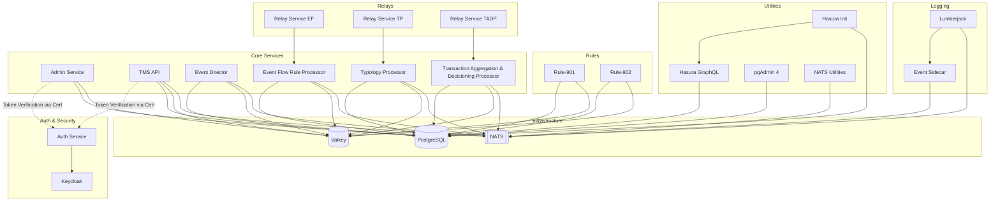

# Tazama Helm Charts

Here is a diagram representing the system architecture and component dependencies based on the Docker Compose configurations. It is rendered using Mermaid.js syntax, which maps out how the services connect to the core infrastructure databases and message queues.

## Component Connectivity Breakdown

With the introduction of the authentication configurations, the architecture now features a dedicated security layer that interacts with the user-facing APIs.

**1. Auth & Security (New)**
*   **Keycloak (`keycloak`)**: This serves as the core identity provider for the system, exposing port 8080 and initializing a test realm via a mounted JSON file.
*   **Auth Service (`auth`)**: This utility acts as the authentication provider interface. It explicitly depends on Keycloak and connects to it via the `AUTH_URL=http://keycloak:8080` environment variable. 

**2. Core Hub Services (Updated with Auth)**
*   **APIs (`admin-service` and `tms`)**: The Admin Service and Transaction Monitoring Service API have been modified by the base auth configuration. Both are now set with `AUTHENTICATED=true` and mount a `test-public-key.pem` certificate volume. While they do not have a hard network dependency on the `auth` container to start up, they logically depend on the authentication ecosystem to verify incoming requests using that certificate.
*   **Processors (`ed`, `tp`, `tadp`, `ef`)**: The backend processors remain unchanged by the auth addition. They do not expose external endpoints and continue to depend heavily on the internal Postgres, Valkey, and NATS infrastructure.

**3. Base Infrastructure**
*   **PostgreSQL, Valkey, and NATS**: These continue to act as the foundational pillars. The core APIs (`admin-service`, `tms`), processors (`ed`, `tp`, `tadp`, `ef`), and rules (`rule-901`, `rule-902`) use specific environment variables (like `CONFIGURATION_DATABASE_USER` and `SERVER_URL=nats:4222`) to connect to these databases and message queues. 

**4. Relays and Interdiction Pipelines**
*   The relay services (`rsef`, `rstp`, `rstadp`) still serve as integration bridges. They depend on their respective processors (`ef`, `tp`, `tadp`) to consume interdiction and alert streams (e.g., `investigation-service` for `tadp`) and output them to new NATS streams.

**5. Logging and Utilities**
*   **Logging**: The `event-sidecar` listens to NATS on the `Lumberjack` subject, and the `lumberjack` logging service depends on both the `event-sidecar` and NATS.
*   **Utilities**: Services like `pgadmin` and `hasura` provide graphical/API layers over PostgreSQL, while `nats-utilities` connects directly to the NATS message broker.

## Tazama Helm Chart Structure
tazama/
├── Chart.yaml                      # Chart metadata and dependencies
├── values.yaml                     # Global and environment-specific toggles
└── templates/
    ├── _helpers.tpl                # Reusable naming and labeling macros
    ├── secrets.yaml                # Database and third-party credentials
    ├── configmaps/                 # Consolidated app settings (.env mappings)
    ├── infrastructure/             # Postgres, Valkey, NATS
    │   ├── postgres.yaml
    │   ├── valkey.yaml
    │   └── nats.yaml
    ├── core/                       # Admin, TMS, Processors, and NATS Relays
    │   ├── admin-service.yaml
    │   ├── tms.yaml
    │   └── processors.yaml (ed, tp, tadp, ef)
    └── rules/                      # Rule-901 and Rule-902 execution pods
        └── rules.yaml (rule-901, rule-902)

## Debugging Notes
After starting the infrastructure services, the remaining issues had to do with configurations and environment
variables pertaining to the core services.  Several cycles of editing and running the core service containers
narrowed down the necessary values.

Additionally, there were issues with node affinity: some services would run on the control plane nodes, resulting
in unavailable resources.  We resolved this by adding node affinity settings to the spec files.  This may be 
primarily an issue with the Kubernetes cluster we are testing, so affinity sections are clearly marked for
easy removal should some streamlining be done in the future

What Was Accomplished:
- Eradicated the Storage Race Condition: The upgraded health check perfectly synchronized the heavy 00-CREATE.sql catalog, ensuring the relational tables (pacs, pain, etc.) were completely built before any microservice attempted a database call.

- Synchronized the Stream Matrix: Every application layer successfully received its missing environment variables (REDIS_IS_CLUSTER, ALERT_DESTINATION, etc.), allowing the strict @tazama-lf/frms-coe-lib library to validate its routes and boot up without panicking.

- Optimized Node Architecture: Implementing master node exclusion steering kept the database off of the control plane node (k8s-rancher01), protecting etcd and permanently resolving the infrastructure API proxy errors.

- Silenced Telemetry Noise: Turning off the default Elastic APM tracking silenced the constant lookup error spam, giving clean, production-ready system logging.

