# Tazama Helm Charts

This repo is an ongoing project to develop a Helm chart for [Tazama](https://github.com/tazama-lf) as an alternative for the [current on-prem Helm](https://github.com/tazama-lf/On-Prem-Helm).  It was rebuilt from scratch using the [Full Stack Docker repo](https://github.com/tazama-lf/Full-Stack-Docker-Tazama) as basis.

The Helm chart and the documentation are intended for DevOps teams looking at deploying Tazama on Kubernetes.  The Helm chart provides a basic reference to show how the important pieces fit together, which a DevOps team might then adapt using their internal best practice, for example, using their own database.  The Helm chart here *should not be considered production-ready.*

A key difference of this Helm chart from the current official ones is that we don't build the container images from source using Jenkins.  Instead, we pull our Tazama container images and rules from existing registries, in particular, [the Tazama DockerHub](https://hub.docker.com/r/tazamaorg/).  We consider the building of the container images to be a separate CI process.

## Key Concepts
The Helm chart decomposes Tazama into the following component groups:

- Infrastructure, consisting of **NATS**, **Postgres**, and **Valkey**.  These are the foundational services used by other Tazama-specific services.  In practice, there is no need to deploy these services in the same Helm chart.  DevOps teams may consider replacing these components with their own versions, following their own best practices.
- Core Services, which are the Tazama-specific microservices.  These are: the **Admin Service**, the **Transaction Monitoring System API**, the **Event Director**, the **Event Flow Rule Processor**, the **Typology Processor**, and the **Transaction Aggregation and Decisioning Processor.**  Admin Service and TMS API are the external facing services.
- Rules, which are the different Tazama evaluation containers.  Currently for our implementation, we deploy only Rule 901 and Rule 902, but this could easily be extended for all other available rule containers.

There are other component groups which may be part of a production deployment but which we have skipped over for our Helm charts.
- Authentication and Security, consisting the the Tazama Auth Service and Keycloak.
- Relays, which provide relay services for some Tazama core services.
- Logging, which provide the logging and monitoring facilities.
- Utilities, which are small conveniences for examining the internal state of Tazama.


### Diagram
Here is a diagram representing the system architecture and component dependencies based on the Docker Compose configurations. It is rendered using Mermaid.js syntax, which maps out how the services connect to the core infrastructure databases and message queues.

```mermaid
graph TD
    %% Base Infrastructure
    subgraph Infrastructure
        PG[(PostgreSQL)]
        VK[(Valkey)]
        MQ[[NATS]]
    end

    %% Auth & Security (NEW)
    subgraph Auth & Security
        KC[Keycloak]
        AUTH[Auth Service]
    end

    %% Core Hub Services
    subgraph Core Services
        ADMIN[Admin Service]
        TMS[TMS API]
        ED[Event Director]
        TP[Typology Processor]
        TADP[Transaction Aggregation & Decisioning Processor]
        EF[Event Flow Rule Processor]
    end

    %% Rule Processors
    subgraph Rules
        R901[Rule-901]
        R902[Rule-902]
    end

    %% Relays
    subgraph Relays
        RSEF[Relay Service EF]
        RSTP[Relay Service TP]
        RSTADP[Relay Service TADP]
    end

    %% Logging
    subgraph Logging
        ES[Event Sidecar]
        LJ[Lumberjack]
    end

    %% Utilities
    subgraph Utilities
        HASURA[Hasura GraphQL]
        H_INIT[Hasura Init]
        PGADMIN[pgAdmin 4]
        NATSUTIL[NATS Utilities]
    end

    %% --- Connections ---

    %% Auth Connections
    AUTH --> KC
    ADMIN -.->|Token Verification via Cert| AUTH
    TMS -.->|Token Verification via Cert| AUTH

    %% Core to Infrastructure Dependencies
    ADMIN --> PG
    ADMIN --> VK
    
    TMS --> PG
    TMS --> VK
    TMS --> MQ
    
    ED --> PG
    ED --> VK
    ED --> MQ
    
    TP --> PG
    TP --> VK
    TP --> MQ
    
    TADP --> PG
    TADP --> VK
    TADP --> MQ
    
    EF --> PG
    EF --> VK
    EF --> MQ

    %% Rules to Infrastructure
    R901 --> PG
    R901 --> VK
    
    R902 --> PG
    R902 --> VK

    %% Relays to Core Components
    RSEF --> EF
    RSTP --> TP
    RSTADP --> TADP

	%% Relay to NATS
	RSEF --> MQ
    RSTP --> MQ
    RSTADP --> MQ

    %% Logging Connections
    ES --> MQ
    LJ --> ES
    LJ --> MQ

    %% Utility Connections
    HASURA --> PG
    H_INIT --> HASURA
    H_INIT --> PG
    PGADMIN --> PG
    NATSUTIL --> MQ
```




### Component Connectivity Breakdown

* **Infrastructure**: Postgres, Valkey, and NATS form the core; backend processors (`ed`, `tp`, `tadp`, `ef`) connect to all three, while `admin-service`, `rule-901`, and `rule-902` connect only to Postgres and Valkey.
* **Auth & Security**: Keycloak serves as the identity provider; `auth` interfaces with it. `admin-service` and `tms` enforce authentication (`AUTHENTICATED=true`) via a public key certificate.
* **Relays**: `rsef`, `rstp`, and `rstadp` connect to `ef`, `tp`, and `tadp` respectively to process interdiction and alert streams, outputting them to NATS.
* **Logging & Utilities**: `event-sidecar` and `lumberjack` handle NATS logging; `pgadmin`, `hasura`, and `nats-utilities` provide administrative and API interfaces.


#### Connections to Base Infrastructure
The system centers around three key infrastructure services: **PostgreSQL** (database), **Valkey** (in-memory store), and **NATS** (message broker).   These act as the central message queue and database infrastructure.

*   **Postgres and Valkey only:** The `admin-service` API, `rule-901`, and `rule-902` require connections exclusively to the Postgres and Valkey databases. 
*   **Postgres, Valkey, and NATS:** Almost all of the core processors—including `tms`, the Event Director (`ed`), the Typology Processor (`tp`), the Transaction Aggregation and Decisioning Processor (`tadp`), and the Event Flow Rule Processor (`ef`)—depend concurrently on all three infrastructure services.

#### User-facing APIs (Core Services)
* `admin-service`: Connects to Postgres and Valkey. Enforces authentication (`AUTHENTICATED=true`) via a mounted `test-public-key.pem` certificate, when used with Authentication Service and Keycloak.
* `tms` (Transaction Monitoring Service): Connects to Postgres, Valkey, and NATS. Enforces authentication using the same public key certificate configuration.

#### Backend Processors (Core Services)
* `ed`, `tp`, `tadp`, and `ef` run concurrently against Postgres, Valkey, and NATS. They do not expose external endpoints and are unaffected by the auth layer.

#### Rules 
 `rule-901` and `rule-902` require connections exclusively to Postgres and Valkey.

#### Auth & Security Layer
* **Keycloak (`keycloak`)**: Core identity provider initializing a test realm via a mounted JSON file. Exposes port 8080.
* **Auth Service (`auth`)**: Connects directly to Keycloak as the authentication provider interface using `AUTH_URL=http://keycloak:8080`.

For now we treat the Authentication & Security Layer as optional.  However, when enabled,  the Admin Service and Transaction Monitoring Service API must be modified by the base auth configuration. They should set an  `AUTHENTICATED=true` and mount a `test-public-key.pem` 

#### Relays and Interdiction Pipelines
Relay services act as integration bridges, consuming specific streams from data processors and outputting them to new NATS streams:

* `rsef`: Connects to `ef` to consume the `interdiction-service-ef` stream.
* `rstp`: Connects to `tp` to consume the `interdiction-service-tp` stream.
* `rstadp`: Connects to `tadp` to consume the `investigation-service` stream for transaction alerts.

#### Logging, Observability, and Utilities

* **Logging**: `event-sidecar` listens to NATS on the `Lumberjack` subject. The `lumberjack` service depends on both the `event-sidecar` and `nats` to capture system events.
* **Database Utilities**: `pgadmin` provides an administrative console for Postgres. `hasura` acts as a GraphQL engine over Postgres, relying on a `hasura-init` script that requires both services to be healthy before executing.
* **Messaging Utilities**: `nats-utilities` connects directly to the NATS service for management.


## Tazama Helm Chart Structure

```
tazama/
├── Chart.yaml                      # Chart metadata and dependencies
├── values.yaml                     # Global and environment-specific toggles
└── templates/
    ├── _helpers.tpl                # Reusable naming and labeling macros
    ├── secrets.yaml                # Database and third-party credentials
    ├── configmaps/                 # Consolidated app settings (.env mappings)
    ├── infrastructure/             # Postgres, Valkey, NATS
    │   ├── postgres.yaml
    │   ├── valkey.yaml
    │   └── nats.yaml
    ├── core/                       # Admin, TMS, Processors, and NATS Relays
    │   ├── admin-service.yaml
    │   ├── tms.yaml
    │   └── processors.yaml (ed, tp, tadp, ef)
    └── rules/                      # Rule-901 and Rule-902 execution pods
        └── rules.yaml (rule-901, rule-902)
```

## Using the Helm chart
Prerequisites are a running Kubernetes cluster, with kubectl and helm installed on a client machine.

To check the Helm chart
```
helm lint ./tazama-helm-dom
```

To deploy the Helm chart, assuming the app is not yet running on Kubernetes
```
helm upgrade --install tazama ./tazama-helm-dom -n dom-tazama --create-namespace
```

To remove the Helm chart
```
# 1. Clear out the current installation
helm uninstall tazama -n dom-tazama

# 2. Delete the PVC so it doesn't try to pin back to k8s-rancher01
kubectl delete pvc postgres-data-postgres-0 -n dom-tazama
```

To render the Helm chart
```
helm template ./tazama-helm-dom
```


## Notes
### To-Do's
- This Helm chart only deploys the pods, however the Tazama configuration is still blank.
- The deployed application does not have any ingress settings.

### Debugging
After starting the infrastructure services, the remaining issues had to do with configurations and environment
variables pertaining to the core services.  Several cycles of editing and running the core service containers
narrowed down the necessary values.

Additionally, there were issues with node affinity: some services would run on the control plane nodes, resulting
in unavailable resources.  We resolved this by adding node affinity settings to the spec files.  This may be 
primarily an issue with the Kubernetes cluster we are testing, so affinity sections are clearly marked for
easy removal should some streamlining be done in the future

What Was Accomplished:
- Eradicated the Storage Race Condition: The upgraded health check perfectly synchronized the heavy 00-CREATE.sql catalog, ensuring the relational tables (pacs, pain, etc.) were completely built before any microservice attempted a database call.

- Synchronized the Stream Matrix: Every application layer successfully received its missing environment variables (REDIS_IS_CLUSTER, ALERT_DESTINATION, etc.), allowing the strict @tazama-lf/frms-coe-lib library to validate its routes and boot up without panicking.

- Optimized Node Architecture: Implementing master node exclusion steering kept the database off of the control plane node (k8s-rancher01), protecting etcd and permanently resolving the infrastructure API proxy errors.

- Silenced Telemetry Noise: Turning off the default Elastic APM tracking silenced the constant lookup error spam, giving clean, production-ready system logging.


